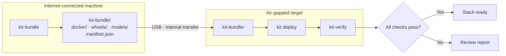

# air-gap-deploy-kit

[](https://github.com/RedBeret/air-gap-deploy-kit/actions/workflows/ci.yml)
[](LICENSE)
[](https://www.python.org/)

**Offline deployment toolkit for the acme-parts-cloud stack.**

`air-gap-deploy-kit` packages Docker images, Python wheels, and Ollama models into a
portable bundle directory for deployment on networks with no internet access. It
dogfoods the full acme-parts-cloud stack:

| Component | Role in this kit |
|-----------|-----------------|
| [`acme-parts-cloud`](https://github.com/RedBeret/acme-parts-cloud) | Docker image bundled and verified |
| [`fde-data-forge`](https://github.com/RedBeret/fde-data-forge) | Python wheel bundled and CLI verified |
| [`rag-eval-bench`](https://github.com/RedBeret/rag-eval-bench) | Python wheel + Ollama model bundled and CLI verified |

> **All data is synthetic.** All image names, digests, and package versions in samples
> are fabricated. No real registry or production infrastructure is used.

<p align="center"></p>

---

## Workflow



---

## Quick Start

```bash
# Install on internet-connected machine
git clone https://github.com/RedBeret/air-gap-deploy-kit.git
cd air-gap-deploy-kit
python -m venv .venv && source .venv/bin/activate
pip install -e .

# (Windows) run.bat sets up the venv

# Clone the two sibling projects used by this portfolio stack
git clone https://github.com/RedBeret/fde-data-forge.git ../fde-data-forge
git clone https://github.com/RedBeret/rag-eval-bench.git ../rag-eval-bench
git clone https://github.com/RedBeret/acme-parts-cloud.git ../acme-parts-cloud

docker build -t acme-parts-cloud:v1.0.0 ../acme-parts-cloud
docker pull postgres:16-alpine

# 1. Build the local projects and dependencies into a real wheelhouse
python -m pip wheel --wheel-dir ./wheelhouse \
  . ../fde-data-forge ../rag-eval-bench

# 2. Bundle explicit local artifacts (no unpublished PyPI names are assumed)
kit bundle --output-dir ./kit-bundle \
  --wheel-source ./wheelhouse \
  --images acme-parts-cloud:v1.0.0 \
  --images postgres:16-alpine \
  --skip-models

# 3. Transfer kit-bundle/ to the air-gapped machine

# 4. Bootstrap kit from the bundle, then deploy
python -m pip install --no-index --find-links ./kit-bundle/wheels air-gap-deploy-kit
kit deploy --bundle-dir ./kit-bundle

# 4. Start acme-parts-cloud (Docker Compose or manual docker run)
# docker load already done by kit deploy — start as normal:
# docker compose up -d

# 5. Verify the stack
kit verify

# 6. Optional: save a JSON report
kit verify --report ./deploy-report.json
```

---

## CLI Reference

| Command | Description |
|---------|-------------|
| `kit bundle` | Pull images + wheels + models into a bundle directory |
| `kit deploy` | Install from bundle (no internet required) |
| `kit verify` | Smoke-test each stack component |
| `kit manifest` | Display the manifest for an existing bundle |
| `kit manifest --check` | Recompute bundle checksums and fail on tampering |

### bundle flags

```
--output-dir DIR        Bundle output directory (default: ./kit-bundle)
--images TEXT           Docker images to bundle (repeatable)
--packages TEXT         Python packages to bundle (repeatable)
--wheel-source PATH     Prebuilt wheel or wheelhouse directory (repeatable)
--models TEXT           Ollama models to bundle (repeatable)
--skip-docker           Skip Docker image bundling
--skip-wheels           Skip Python wheel download
--skip-models           Skip Ollama model copy
```

### deploy flags

```
--bundle-dir DIR        Path to bundle directory (default: ./kit-bundle)
--skip-docker           Skip docker load step
--skip-wheels           Skip pip install step
--report PATH           Save JSON report
```

### verify flags

```
--acme-url URL          acme-parts-cloud base URL (default: http://localhost:8000)
--ollama-url URL        Ollama base URL (default: http://localhost:11434)
--ollama-model TEXT     Model to check for (default: gemma:2b)
--report PATH           Save JSON report
```

---

## Bundle Structure

```
kit-bundle/
  manifest.json           — digest, checksum, and metadata index
  docker/
    redberet_acme-parts-cloud_latest.tar
    postgres_16-alpine.tar
  wheels/
    fde_data_forge-1.0.0-py3-none-any.whl
    rag_eval_bench-1.0.0-py3-none-any.whl
    air_gap_deploy_kit-1.0.0-py3-none-any.whl
    ...dependencies...
  models/
    gemma_2b/
      sha256-...
      sha256-...
```

See `samples/bundle_manifest_sample.json` for a full manifest example.

Every regular file in the bundle is recorded in `manifest.json` under
`file_checksums`. Run `kit manifest --check --bundle-dir ./kit-bundle` after transfer to
catch missing files or a corrupted copy before deploying.

---

## Case Study: Deploying to an Isolated Lab Network

> Scenario: a secure analysis lab with no internet access needs the full acme-parts-cloud
> stack for parts data quality work. All data is synthetic.

**On the build machine (internet access):**

```bash
# Build or pull everything needed
docker build -t acme-parts-cloud:v1.0.0 ../acme-parts-cloud
docker pull postgres:16-alpine
python -m pip wheel --wheel-dir ./wheelhouse \
  . ../fde-data-forge ../rag-eval-bench

# Bundle
kit bundle --output-dir ./kit-bundle \
  --wheel-source ./wheelhouse \
  --images acme-parts-cloud:v1.0.0 \
  --images postgres:16-alpine \
  --skip-models
```

**Transfer to lab (USB drive):**

```bash
cp -r ./kit-bundle /media/usb/
# carry drive to lab machine
```

**On the lab machine (no internet):**

```bash
python -m pip install --no-index --find-links /media/usb/kit-bundle/wheels \
  air-gap-deploy-kit
kit deploy --bundle-dir /media/usb/kit-bundle
# → docker load: 2 images loaded
# → pip install --no-index: 12 wheels installed

docker compose up -d   # start acme-parts-cloud + postgres

kit verify
# acme-parts-cloud  ✓  GET /admin/healthz → 200 ok
# fde-data-forge    ✓  fde --help exit 0
# rag-eval-bench    ✓  rag-eval --help exit 0
# ollama            ✓  Ollama running; gemma:2b available
```

Once Docker Compose is up, the whole offline install is one `kit deploy` and one `kit verify`, with no network calls at any step. That last part is the point: rehearse the install with networking off *before* you carry the drive on-site.

---

## Verify Output Example

```
Stack Verification
 Component          Status   Detail
 acme-parts-cloud   ✓ OK     GET /admin/healthz → 200 ok
 fde-data-forge     ✓ OK     fde --help exit 0: Usage: fde [OPTIONS]...
 rag-eval-bench     ✓ OK     rag-eval --help exit 0: Usage: rag-eval [OPTIONS]...
 ollama             ✓ OK     Ollama running; gemma:2b available as gemma:2b

4/4 checks passed.
```

---

## Project Layout

```
kit/
  bundle/   — docker, wheel, model bundlers + manifest I/O
  deploy/   — offline installer + stack verifier
  report/   — rich terminal tables + JSON report builder
  cli.py    — click entry point
tests/
  test_manifest.py   — 8 tests
  test_bundle.py     — 5 tests
  test_verifier.py   — 9 tests
samples/
  bundle_manifest_sample.json
```

---

## Related Projects

- [`acme-parts-cloud`](https://github.com/RedBeret/acme-parts-cloud) — Synthetic parts catalog API
- [`fde-data-forge`](https://github.com/RedBeret/fde-data-forge) — Defect detection and normalization CLI
- [`rag-eval-bench`](https://github.com/RedBeret/rag-eval-bench) — RAG evaluation harness

---

## License

MIT © 2026 Steven Espinoza. See [LICENSE](LICENSE).
