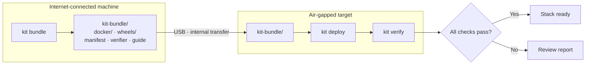

# air-gap-deploy-kit

[](https://github.com/RedBeret/air-gap-deploy-kit/actions/workflows/ci.yml)
[](LICENSE)
[](https://www.python.org/)

**Offline deployment toolkit for the acme-parts-cloud stack.**

`air-gap-deploy-kit` packages explicit Docker images and Python wheels into a
portable, checksummed directory for deployment on networks with no internet access. It
dogfoods the full acme-parts-cloud stack:

| Component | Role in this kit |
|-----------|-----------------|
| [`acme-parts-cloud`](https://github.com/RedBeret/acme-parts-cloud) | Docker image bundled and verified |
| [`fde-data-forge`](https://github.com/RedBeret/fde-data-forge) | Python wheel bundled and CLI verified |
| [`rag-eval-bench`](https://github.com/RedBeret/rag-eval-bench) | Python wheel bundled and CLI verified |

> **All data is synthetic.** All image names, digests, and package versions in samples
> are fabricated. No real registry or production infrastructure is used.

<p align="center"></p>

---

## Workflow



---

## Quick Start

```bash
# Install on internet-connected machine
git clone https://github.com/RedBeret/air-gap-deploy-kit.git
cd air-gap-deploy-kit
python -m venv .venv && source .venv/bin/activate
pip install -e .

# (Windows) run.bat sets up the venv

# Clone the two sibling projects used by this portfolio stack
git clone https://github.com/RedBeret/fde-data-forge.git ../fde-data-forge
git clone https://github.com/RedBeret/rag-eval-bench.git ../rag-eval-bench
git clone https://github.com/RedBeret/acme-parts-cloud.git ../acme-parts-cloud

docker build -t acme-parts-cloud:v1.0.0 ../acme-parts-cloud
docker pull postgres:16-alpine

# 1. Build the local projects and dependencies into a real wheelhouse
python -m pip wheel --wheel-dir ./wheelhouse \
  . ../fde-data-forge ../rag-eval-bench

# 2. Bundle explicit local artifacts (no unpublished PyPI names are assumed)
kit bundle --output-dir ./kit-bundle \
  --wheel-source ./wheelhouse \
  --images acme-parts-cloud:v1.0.0 \
  --images postgres:16-alpine \
  --compose-file docker-compose.yml

# Prove the wheel install with no image pull and no container network
kit rehearse --bundle-dir ./kit-bundle

# 3. Transfer kit-bundle/ to the air-gapped machine

# 4. Bootstrap kit from the bundle, then deploy
python -m pip install --no-index --find-links ./kit-bundle/wheels air-gap-deploy-kit
kit deploy --bundle-dir ./kit-bundle

# 5. Start acme-parts-cloud (Docker Compose or manual docker run)
# docker load already done by kit deploy — start as normal:
# docker compose up -d

# 6. Verify the stack
kit verify

# 7. Optional: save a JSON report
kit verify --report ./deploy-report.json
```

---

## CLI Reference

| Command | Description |
|---------|-------------|
| `kit bundle` | Collect explicit images and wheels into a bundle directory |
| `kit deploy` | Install from bundle (no internet required) |
| `kit rehearse` | Install wheels in a network-isolated throwaway container |
| `kit verify` | Smoke-test each stack component |
| `kit manifest` | Display the manifest for an existing bundle |
| `kit manifest --check` | Recompute checksums and detect transfer corruption |

### bundle flags

```
--output-dir DIR        Bundle output directory (default: ./kit-bundle)
--images TEXT           Docker images to bundle (repeatable)
--packages TEXT         Python packages to bundle (repeatable)
--wheel-source PATH     Prebuilt wheel or wheelhouse directory (repeatable)
--compose-file PATH     Compose file to include and checksum
--skip-docker           Skip Docker image bundling
--skip-wheels           Skip Python wheel collection
```

Ollama model export is disabled: blobs without Ollama manifests cannot be restored as
usable models. `--models` fails clearly instead of creating a broken bundle.

### deploy flags

```
--bundle-dir DIR        Path to bundle directory (default: ./kit-bundle)
--skip-docker           Skip docker load step
--skip-wheels           Skip pip install step
--report PATH           Save JSON report
```

### rehearse flags

```
--bundle-dir DIR        Bundle to verify and rehearse
--image TEXT            Preloaded Python image (default: python:3.12-slim)
--smoke TEXT            Post-install command (repeatable)
--load-docker           Explicitly load Docker tars into the host and verify image IDs
```

`rehearse` uses `docker run --pull=never --network none`; the image must already exist
locally. Any integrity or wheel-install failure stops before smoke commands or host image
loading. Docker tar loading is skipped unless `--load-docker` is explicitly supplied.

### verify flags

```
--acme-url URL          acme-parts-cloud base URL (default: http://localhost:8000)
--ollama-url URL        Ollama base URL (default: http://localhost:11434)
--ollama-model TEXT     Optional model check (default: gemma3:4b)
--report PATH           Save JSON report
```

---

## Bundle Structure

```
kit-bundle/
  manifest.json           — digest, checksum, and metadata index
  VERIFY_BUNDLE.py        — dependency-free check run before installation
  INSTALL_OFFLINE.md      — component-aware field guide
  docker/
    redberet_acme-parts-cloud_latest.tar
    postgres_16-alpine.tar
  wheels/
    fde_data_forge-1.1.0-py3-none-any.whl
    rag_eval_bench-1.1.0-py3-none-any.whl
    air_gap_deploy_kit-1.1.0-py3-none-any.whl
    ...dependencies...
  docker-compose.yml      — only when supplied with --compose-file
```

See `samples/bundle_manifest_sample.json` for a full manifest example.

Every regular file in the bundle is recorded in `manifest.json` under
`file_checksums`. Run `kit manifest --check --bundle-dir ./kit-bundle` after transfer to
catch missing, changed, unexpected or corrupted files before deploying. These unsigned
checksums do not authenticate the bundle; compare its manifest digest through a separate
trusted channel when malicious replacement is in scope.

---

## Case Study: Deploying to an Isolated Lab Network

> Scenario: a secure analysis lab with no internet access needs the full acme-parts-cloud
> stack for parts data quality work. All data is synthetic.

**On the build machine (internet access):**

```bash
# Build or pull everything needed
docker build -t acme-parts-cloud:v1.0.0 ../acme-parts-cloud
docker pull postgres:16-alpine
python -m pip wheel --wheel-dir ./wheelhouse \
  . ../fde-data-forge ../rag-eval-bench

# Bundle
kit bundle --output-dir ./kit-bundle \
  --wheel-source ./wheelhouse \
  --images acme-parts-cloud:v1.0.0 \
  --images postgres:16-alpine \
  --compose-file docker-compose.yml
```

**Transfer to lab (USB drive):**

```bash
cp -r ./kit-bundle /media/usb/
# carry drive to lab machine
```

**On the lab machine (no internet):**

```bash
python -m pip install --no-index --find-links /media/usb/kit-bundle/wheels \
  air-gap-deploy-kit
kit deploy --bundle-dir /media/usb/kit-bundle
# → docker load: 2 images loaded
# → pip install --no-index: 12 wheels installed

docker compose up -d   # start acme-parts-cloud + postgres

kit verify
# acme-parts-cloud  ✓  GET /admin/healthz → 200 ok
# fde-data-forge    ✓  fde --help exit 0
# rag-eval-bench    ✓  rag-eval --help exit 0
# ollama            ⚠  optional service unavailable; model export is disabled
```

Once Docker Compose is up, the whole offline install is one `kit deploy` and one `kit verify`, with no network calls at any step. That last part is the point: rehearse the install with networking off *before* you carry the drive on-site.

---

## Verify Output Example

```
Stack Verification
 Component          Status   Detail
 acme-parts-cloud   ✓ OK     GET /admin/healthz → 200 ok
 fde-data-forge     ✓ OK     fde --help exit 0: Usage: fde [OPTIONS]...
 rag-eval-bench     ✓ OK     rag-eval --help exit 0: Usage: rag-eval [OPTIONS]...
 ollama             ✗ FAIL   Ollama unavailable or requested model not found

3/4 checks passed.
⚠ Ollama check failed — generation scoring unavailable.
```

---

## Project Layout

```
kit/
  bundle/   — docker and wheel bundlers + manifest I/O
  deploy/   — offline installer + stack verifier
  rehearse/ — fail-closed, network-isolated install rehearsal
  report/   — rich terminal tables + JSON report builder
  cli.py    — click entry point
tests/
  test_manifest.py   — 8 tests
  test_bundle.py     — 5 tests
  test_verifier.py   — 9 tests
  test_rehearse.py   — injected-runner offline and fail-closed behavior
  test_rehearse_docker.py — live test only when the image is already present
samples/
  bundle_manifest_sample.json
```

---

## Related Projects

- [`acme-parts-cloud`](https://github.com/RedBeret/acme-parts-cloud) — Synthetic parts catalog API
- [`fde-data-forge`](https://github.com/RedBeret/fde-data-forge) — Defect detection and normalization CLI
- [`rag-eval-bench`](https://github.com/RedBeret/rag-eval-bench) — RAG evaluation harness

---

## License

MIT © 2026 Steven Espinoza. See [LICENSE](LICENSE).
